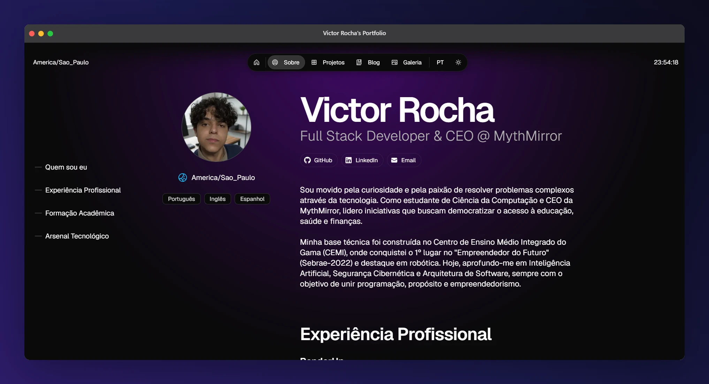

# Victor Rocha / strattegia.dev

<p align="center">
  <a href="https://nextjs.org/"></a>
  <a href="https://www.typescriptlang.org/"></a>
  <a href="https://vercel.com/"></a>
  <a href="https://opensource.org/licenses/CC-BY-NC-4.0"></a>
</p>



**Uma vitrine digital de alta performance.**

> Soluções digitais com estética minimalista, arquitetura robusta e foco na experiência do usuário.

---

## ⚡ Sobre o Projeto

Este repositório hospeda o ecossistema digital pessoal de Victor Rocha.  
Mais do que um simples portfólio, é uma aplicação Next.js 14 (App Router) moderna, projetada para demonstrar domínio em arquitetura de software frontend, otimização de performance (Core Web Vitals) e design de interface (UI/UX).

O projeto utiliza o sistema de design Once UI como base, mas foi profundamente refatorado com funcionalidades exclusivas, animações aceleradas por hardware e uma estratégia agressiva de entrega de conteúdo estático.

## 🛠 Tech Stack & Arquitetura

### Core

- **Framework:** Next.js 16 (App Router / Server Components)
- **Linguagem:** TypeScript
- **Estilização:** Once UI (SCSS Modules / CSS Variables) & Classnames
- **Content:** MDX (com componentes customizados via next-mdx-remote)

### Engenharia de Performance & SEO

- **Web Vitals Otimizados:** Resolução cirúrgica de problemas de LCP (Largest Contentful Paint), INP (Interaction to Next Paint) e CLS (Cumulative Layout Shift).
- **Delivery de Imagens:** Bypass da otimização do Node.js em favor da entrega instantânea via CDN Edge em formatos modernos (.webp / .avif).
- **Animações Fluidas:** Transições de Galeria e Lightbox refatoradas usando curvas de Bézier (cubic-bezier) e renderização via GPU (translate3d/scale3d).
- **SEO & Metadados Avançados:** JSON-LD Schemas dinâmicos, sitemap.ts com prioridades hierárquicas e robots.ts otimizado.

### Infra & Analytics

- **Deploy:** Vercel
- **Monitoramento:** Vercel Analytics & Speed Insights
- **SEO:** JSON-LD Schemas dinâmicos e Metadata API do Next.js.

---

## 🚀 Como Rodar Localmente

Siga os passos abaixo para clonar e executar o projeto na sua máquina.

### 1. Clone o repositório

```bash
git clone https://github.com/strattegia-mp3/personal-portfolio.git
cd personal-portfolio
```

### 2. Instale as dependências

```bash
npm install
```

### 3. Configuração de Variáveis de Ambiente

Renomeie o arquivo `.env.example` para `.env.local` e preencha as chaves essenciais:

```env
# URL Base (Crucial para Metadados e Compartilhamento Social)
NEXT_PUBLIC_BASE_URL="http://localhost:3000"

# Integração Mailchimp (Newsletter)
MAILCHIMP_API_KEY="sua_api_key"
MAILCHIMP_SERVER_PREFIX="usX"
MAILCHIMP_AUDIENCE_ID="seu_audience_id"
```

### 4. Execute o servidor de desenvolvimento

```bash
npm run dev
```

Acesse [http://localhost:3000](http://localhost:3000).

---

## 📂 Estrutura do Projeto

```plaintext
src/
├── app/
│   ├── api/            # Serverless Functions (ex: Inscrição Newsletter)
│   ├── blog/           # Listagem e páginas dinâmicas do Blog
│   ├── work/           # Portfólio de Projetos e Casos de Estudo
│   ├── gallery/        # Masonry Grid responsivo com Lightbox
│   └── layout.tsx      # Root Layout (Configurações de Fontes, Temas e Metadata)
├── components/
│   ├── i18n/           # Componentes híbridos de internacionalização
│   ├── mdx/            # Renderizadores e tipografia customizada para Markdown
│   └── konamiCode/     # Easter Egg componentizado (Lazy loaded)
├── resources/          # Dicionários de tradução e configurações do site
└── views/              # Client Components agregadores para as páginas principais
```

---

## ✨ Funcionalidades em Destaque

### 🌍 Arquitetura Híbrida de i18n (SEO + UX)

Um sistema de internacionalização (PT/EN) construído do zero, sem o overhead de bibliotecas pesadas.

- **No Servidor (SEO):** A API `generateMetadata` renderiza os títulos e descrições originais em HTML puro para indexação perfeita pelo Googlebot.
- **No Cliente (UX):** O componente customizado `DynamicTabTitle` intercepta o estado do idioma e altera a aba do navegador instantaneamente para o usuário, garantindo uma navegação reativa e fluida.

### 📝 Blog & Projetos com MDX Power

Os posts do blog e estudos de caso suportam componentes interativos imersos no Markdown, incluindo:

- `<CodeBlock />` com syntax highlighting nativo.
- Renderização condicional por idioma (`<Pt>` e `<En>`) em um único arquivo `.mdx`.
- `<ShareSection />` integrado com a Web Share API nativa (iOS/Android).

### 🕹️ Konami Code (Arcade Easter Egg)

Pressione **↑ ↑ ↓ ↓ ← → ← → B A** para invocar um *System Override*.

Um modal construído com **Framer Motion** e **canvas-confetti** que força uma paleta de cores Cyberpunk/Neon, garantindo visibilidade perfeita independentemente do tema do sistema (Dark/Light). Carregado via **Lazy Loading** (`next/dynamic`) para impacto zero no tempo de carregamento da página (**TBT**).

### 📬 Newsletter (Zero-Backend)

Integração direta de formulários com a API do **Mailchimp** (via Server/API Routes do Next.js). Implementa validação segura e estratégia de **Double Opt-in** para compliance com a **LGPD/GDPR**.

---

## 🤝 Créditos & Licença

Este projeto utiliza como base o template **Magic Portfolio** da **Once UI**, distribuído sob licença **CC BY-NC 4.0**.

- **Design System:** Once UI
- **Desenvolvimento & Customizações:** Victor Rocha

<div align="center">
  <p><code>~ $ "Desenvolvido com 💜 e TypeScript por Victor Rocha."</code></p>
</div>
